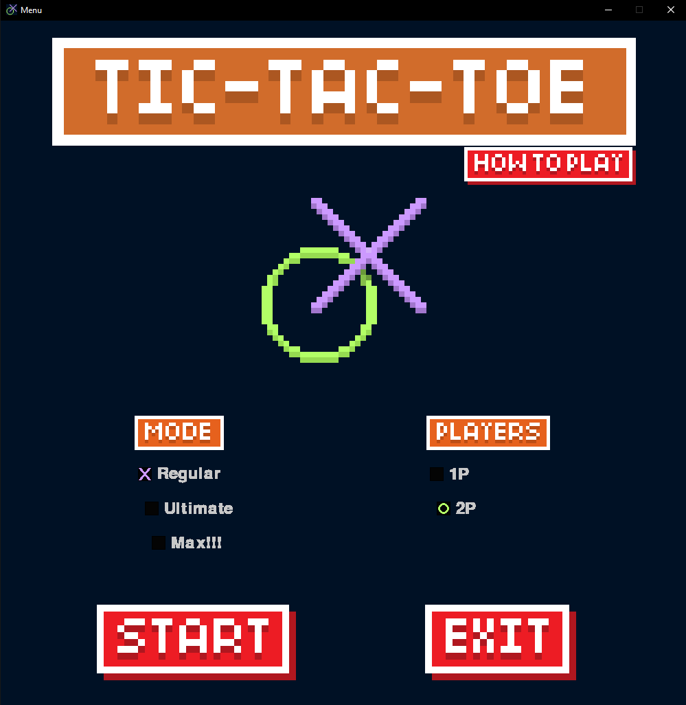

# Ultimate Tic Tac Toe
A Tier 2 driven coding project to generate an Ultimate tic-tac-toe game to be played. [How it works](https://www.thegamegal.com/2018/09/01/ultimate-tic-tac-toe/)

# Run locally
- `pip3 install -r requirements.txt`
- `python3 main.py`

# How to Run game
Use main.py as root script
- choose config and Start!
- 'r' to restart game
- 'esc' to return to main menu

# Start menu

# Regular game 

# Ultimate Mode!

# Max Mode!!!

# Winning Screen
